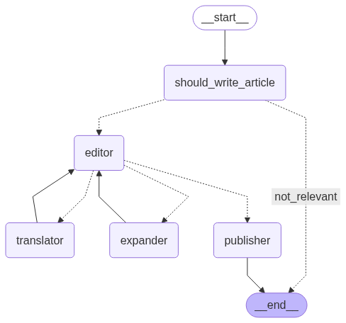

# Evaluating AI Agents

## Aim

This is a manual to establish a fricitonless way of testing and evaluating Agentic systems both for the developer and QA.

## Agentic Evaluations

<!-- We can see an Agentic workflow:

 -->

A Unit Test in agentic terms is the smallest block of code that uses an llm to determine the ROUTE and the RESPONSE.

It may contain other deterministic functionality which we can test in the usual way, but this manual focusses on testing and monitoring Agentic systems.

## App

The app is based on Langgraph which is able to produce an image of the workflow as it is a graph based application.



The 'should_write' agent decides of an article is football related, and if so an article is written based on the healdine given.

```
"""You are a grader assessing whether a news article concerns a football transfer. \n
    Check if the article explicitly mentions player transfers between clubs, potential transfers, or confirmed transfers. \n
    Provide a binary score 'yes' or 'no' to indicate whether the news is about a football transfer."""
```

The editor then supervises two agents:

1. An agent that translates "You are a translator converting articles into German. Translate the text accurately while maintaining the original tone and style."
2. An agent that expands an article if too short "You are a writer tasked with expanding the given article to at least 200 words while maintaining relevance, coherence, and the original tone."

If it feels these two criteria are met it passes the article to the publisher agent.

The editor agent then decides if it is in German, of correct length, sensational enough and if so moves to the publishing agent where it is published and the workflow comes to and END.

## Patterns

### Routing


One fundamental pattern is ROUTING - does the Agent select the correct tool/function/skill with the correct inputs?

`src\article_writer_langgraph.py` shows the routing pattern for `system_grader` and the log output is in article_writer.csv:


`ArticlePostabilityGrader` logs to `article_writer_can_publish` (we can have just one log file):


> In general: 


There is also NEXT - does the Agent select the correct next step where this is applicable?


### Output

For a given input, we will obtain an output. 

We may retrieve additonal context to support the generation of the output.

We will also have REFERENCES - ground truths.

Our goal is to get a number of datasets:

INPUT - OUTPUT - CONTEXT - REFERENCE

TOOL_CALLED - ARGUMENTS - NEXT - EXPECTED

Once we have these there are many libraries or our own custom evaluations that we can use.

We will have a confusion matrix (context may or not exist):

INPUT - OUTPUT - CONTEXT - REFERENCE

We can then work out an evaluation.

We look for OMISSIONS - ADDITIONS - CONTRADICTIONS - COMPLETENESS as alternatives to traditonal F1 scores although these can be computed as well.

We can also evaluate system fails:


## Frictionless

The process needs to be frictionless for developers.

At an accessability talk, the speaker said 'How do you make a blueberry muffin?'. 

You put the blueberries in at the beginning and not stuff them in at the end.

This can be done either with supplied decorators as in `openai_agent_logging.py` for tool calling or by supplying the appropriate tracing function as in article_writer_langgraph.ipynb`:

```
##############################################
#
# This can be standardised during development
# DATE|COMPONENT_CODE|MODEL|TEMPERATURE|INPUT|OUTPUT and any optional fields
#
with open("article_writer.csv", "a", encoding="utf-8") as f:
    f.write(
        f"{report_date}|EVALUATOR|{MODEL}|{TEMPERATURE}|{INPUT}|{OUTPUT.binary_score}\n"
    )
##############################################
```
The core tracing is for datetime|component|model|temperature|input|output

Additional data can be added optionally in a structured way.

This serves as testing, evaluationg and monitoring from development to production.

The developer and QA work towards making each UNIT fully introspective.

*Having researched the various Observability tools, I think this logging approach is the simplest and possibly most effective as it separates data collection and data evaluation, and also avoids being tied to any framework.*

