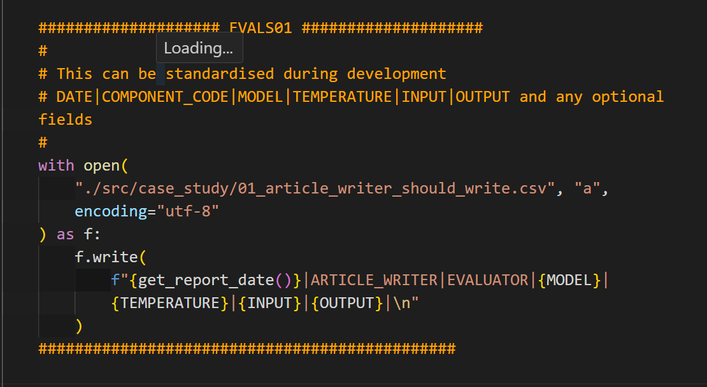

# Case Studies

## First steps

We need to understand what the app does and what the workflow is.

We identify the Agentic points where we use LLMs and then apply logging.

- What does a satisified user look like?
- What would a disappointed user look like?
- How do we define a successful app from our point of view?

We need to make each agent self-evaluating. That is, we need to export to CSV input|output|context|tool_use|metadata.

Then we can add references if we have them and run our evals.

We will do this manually to get a sense of what we need to implement and if possible scale up with automations and LLM as judge.

## Case Study 1

### Langgraph

In this first case study, we use a sample Langgraph app located in `src/case_study1/langgraph/app_article_writer.py`

Evals where done after the app was built so we idendify the Agentic points where we use LLMs and then apply logging.

There are 4 LLM instances and this is where we do our Agentic Evals.

EVAL01:

We log to `01_article_writer_should_write.csv` and do the same for the other 3 evals.

We also do the same for `tool_calling.py`, logging to `05_tool_calling.csv`.

## Case Study 2

### OpenAI Agents

This is a case study using a Deep Research clone app by Kody Simpson.

I coded up the app so that logging could be done in development rather than in QA.

The repo is [https://github.com/Python-Test-Engineer/llm-evaluation-framework](https://github.com/Python-Test-Engineer/llm-evaluation-framework)

Located in src/case_study/deep_research it uses the OpenAI Agent SDK.

It enables us to use an actual app to set up Evals.

`uv run ./src/deep_research/main.py`
