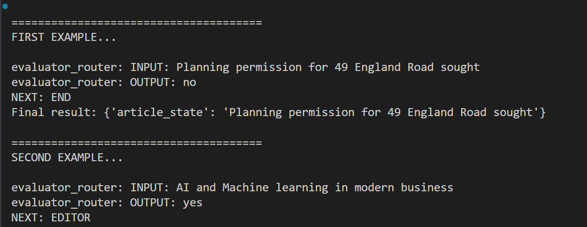
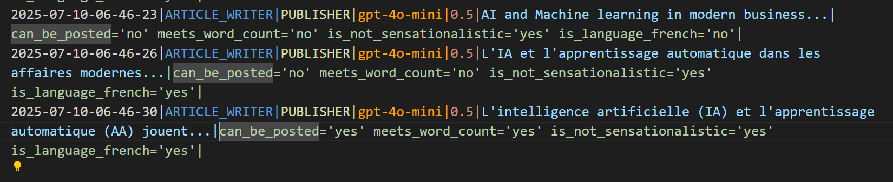

# Case Study 1

## Article Writer

This is a leaf level sub graph meaning it is at the end of all the Agentic actions.

The first node `should_write_article` determines if the short article headline is about the selected content topic, in our case AI/Technology.

If so, it goes to the editor that ensure it is translated into the chosen language, French, and has sufficient length and is not sensational. 

This then passes to the `publisher` and if all are yes, it set `postability` to yes and in the case ends there, though in production some actions would be taken.

As you can see from the output, the app works through each of these processes and if all are `yes` then postability is set to `yes` and we move to `__END__`.

This case study shows how we can evaluate ROUTING and also parallel tool call - we can think of a node as a tool call as everything is just a function.

If we had an action at the publisher node, we could then verify that articles are only published if all thre criteria are `yes`. We could do this by setting a `is_published=yes` and we can then check deterministically that if `is_published=yes` then all the others should also be yes.

We can dump all the output in the log file so that we can see more detail about the LLM call like tokens etc. or filter before dumping to log file.