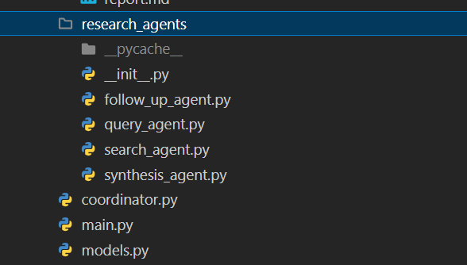

# Case Study 2

## The App

This case study is about a deep research agent that creates a report based on a user query.

1. Create N (configurable) questions to ask.
2. Create X (configurable) search queries for each question.
3. Use a SYNTHESISER agent to create the final report.

The coodrdinator.py has access to 4 agents, (follow_up_agent.py is not used).

## Evals

We need to determine what our top level evals are:

For a given question, we get a report that is about the question, has the required length and answers the question. We can check length deterministically, we can check the quality firstly by human and then build our LLM judge. "A useful report"

We can have evals for the steps to make the report:

1. Check N and X config values were followed.
2. Evaluate the relevance of questions and queries in relation to the question.
3. Did the article and retrieved content perform well on standard RAG evaluations - see Evals section.

## Tracing

TODO: Add these evals and discuss here...