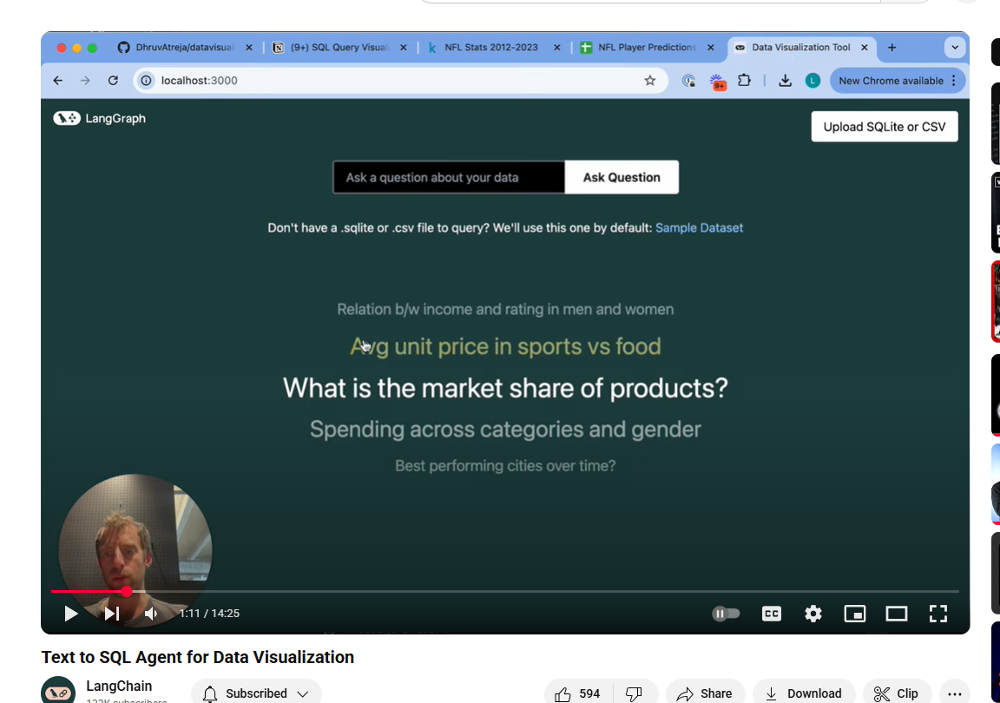
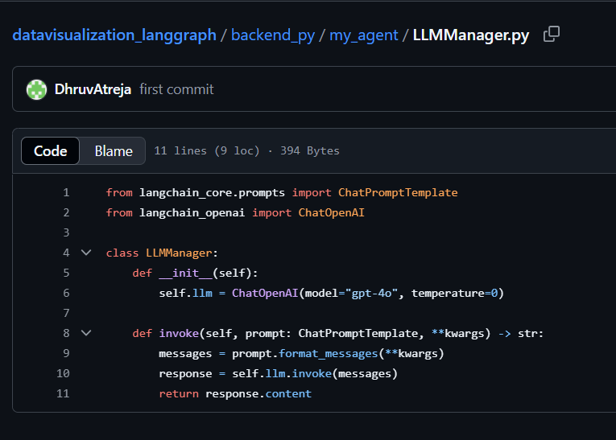
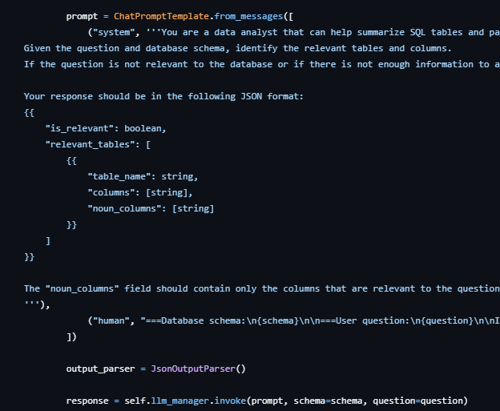

# SQL Agent

## App

We will evaluate the SQL Agent from Langchain as the basis for a chain of SQL in an Agentic app.

This is a full stack app with detailed video by Langchain using the repo and article below.

[https://www.youtube.com/watch?v=LRcjlXL9hPA](https://www.youtube.com/watch?v=LRcjlXL9hPA)

[https://github.com/DhruvAtreja/datavisualization_langgraph/tree/main](https://github.com/DhruvAtreja/datavisualization_langgraph/tree/main
)

[https://blog.langchain.com/data-viz-agent/](https://blog.langchain.com/data-viz-agent/)

## Eval

We can consolidate the principles we have been developing in this manual:

1. Find the Agentic inflection points.
2. Log out INPUT-CONTEXT-OUTPUT-METADATA

The app has a central LLM Manager ([https://github.com/DhruvAtreja/datavisualization_langgraph/blob/main/backend_py/my_agent/LLMManager.py](https://github.com/DhruvAtreja/datavisualization_langgraph/blob/main/backend_py/my_agent/LLMManager.py)

It is tempting to use this one LLM inflection point to do our logging.

However, a fundamental principle is that each agent contains its own observability capability and we would be vulnerable to changes/removal of the LLM Manger.

This we will look throuhg the [https://github.com/DhruvAtreja/datavisualization_langgraph/tree/main/backend_py/my_agent](https://github.com/DhruvAtreja/datavisualization_langgraph/tree/main/backend_py/my_agent) folder and find the LLM calls.

We will then add our logging, customised to the agent, and logged to its own logging file.

We can always merge log files later if needed.

Here we can see the SQL Agent [https://github.com/DhruvAtreja/datavisualization_langgraph/blob/main/backend_py/my_agent/SQLAgent.py](https://github.com/DhruvAtreja/datavisualization_langgraph/blob/main/backend_py/my_agent/SQLAgent.py) and the INPUTS of `prompt, schema and question` along with the OUTPUT of `parsed_response` can be logged along with all the other metadata from then input and output side as needed.

We can also log the STATE machine at any point too.

Again, it ends up being the insertion of a log statement after any LLM call:

with its exact structure varying with the agent and being logged to its own associated log file.