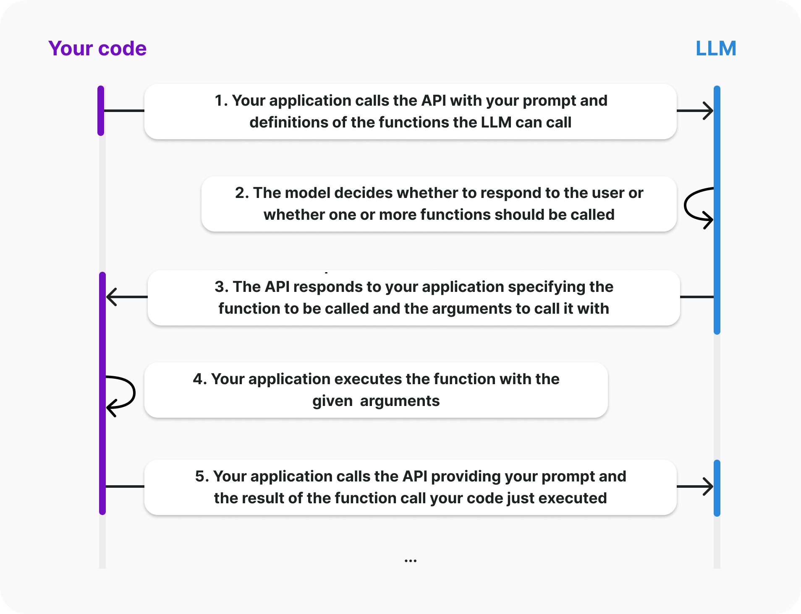

# Agents

An AI Agent is some code that has a conversation with an LLM to determine application flow.

Agents have access to tools that enable them to carry out functions and return observations to the application layer along with NEXT steps.


## 180 degrees  

There are two concepts that seem to turn coding upside down. Like turning a computer mouse 180 degrees, there is no more complexity involved, still just up, down, left and right but done in the opposite way to usual.

### Autonomy

Autonomous AI Agents are able to determnine a next step based on the LLM which can then be used by the application layer to move on to the next step. It can seem tricky to see if we are coding imperatively or whether we have turned over direction to the AI Agent.

### Creating an endpoint

Prompt or Flow Engineering is where we add additional instruction to the query for the LLM to follow.

### Natural Language

In many ways it is like pseudo-code where we spec out what we want the endpoint API to do along with the data we send:

```

REACT_SYSTEM_PROMPT = """
You operate by running a loop with the following steps: Thought, Action, Observation.
You are provided with function signatures within <tools></tools> XML tags.
You may call one or more functions to assist with the user query. Don' make assumptions about what values to plug
into functions. Pay special attention to the properties 'types'. You should use those types as in a Python dict.

For each function call return a json object with function name and arguments within <tool_call></tool_call> XML tags as follows:

<tool_call>
{"name": <function-name>,"arguments": <args-dict>, "id": <monotonically-increasing-id>}
</tool_call>

Here are the available tools / actions:

<tools>
%s
</tools>

Example session:

<question>What's the current temperature in Madrid?</question>
<thought>I need to get the current weather in Madrid</thought>
<tool_call>{"name": "get_current_weather","arguments": {"location": "Madrid", "unit": "celsius"}, "id": 0}</tool_call>

You will be called again with this:

<observation>{0: {"temperature": 25, "unit": "celsius"}}</observation>

You then output:

<response>The current temperature in Madrid is 25 degrees Celsius</response>

Additional constraints:

- If the user asks you something unrelated to any of the tools above, answer freely enclosing your answer with <response></response> tags.
"""

```

We can pass in data for the query to the LLM as a prompt template.

These two concepts, Autonomy and Prompt Engineering, are counter intuitive based on how we have been coding.

## Tools

AI Agents can also have tools, functions, bound to them so that the LLM can select the most appropriate tool based on the response.

The function and arguments are then executed and added back into the prompt.

A canonical example is doing a web search for additional data. If we need the weather for a location as part of the query then we need to get the weather first. A tool that gets the weather from a Weather API can then be used.

The code is run on our box not the LLMs.

OpenAI shows this in the following image:



## Patterns

There are many patterns but 4 main ones are;

1. Reflection

2. Tool Calling

3. Planning

4. Multi Agent

The last one, Multi Agent, is a pattern where Agents can connect with each other and various hierarchies can be built.

Having a Supervisor Agent that manages agents and crews can be useful for large scale projects.

It is worth noting that Agents do not have to have an LLM and can be coded in the traditonal way. These softwared designs are well established over decades.

## Pydantic AI

...

## SMOLAGENTS

A new technology that combines LLM with Python rather than LLM and JSON for tool use...

## Frameworks

<br>