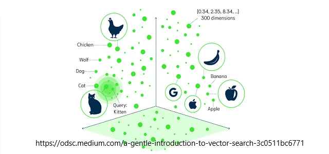

# Vector Databases

## Sematic search

Unlike keyword search, semantic search uses the context of the document to rank and deliver search results based on their relevance.

The closer two points in vector space are, the more similar they are.

Cat, Feline, Kitten will be closer together that Dog, Canine, Pup.

The image above shows a vector space where the closer two points are, the more similar they are. This is in 3 dimensions but in reality the number of dimensions can range from 386 to 1536.

There are a few different methods such as cosine similarity, dot product, Euclidean distance etc.

## Vector Databases

There are a number of exclusive vector databases that can be used for semantic search, but many traditonal databases have Vector search available as an option.

Postgres has PGVector and PGAI for example that enable us to use just one database for hybrid search - both keyword and semantic search.

This can be much faster as the semantic search is done in the database as SQL actions and there is not latency involved to connect to systems elsewhere.

Indeed, Postgres claims to be as fast if not faster than many commercial Vector Database Services, [https://www.timescale.com/blog/how-we-made-postgresql-as-fast-as-pinecone-for-vector-data/](https://www.timescale.com/blog/how-we-made-postgresql-as-fast-as-pinecone-for-vector-data/)