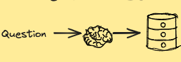
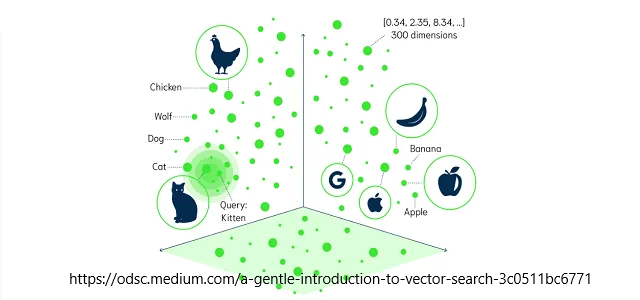
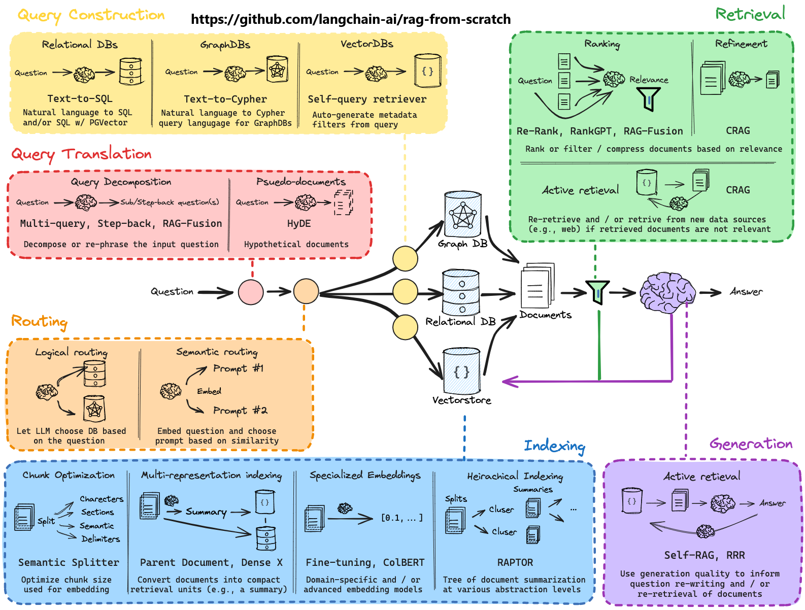
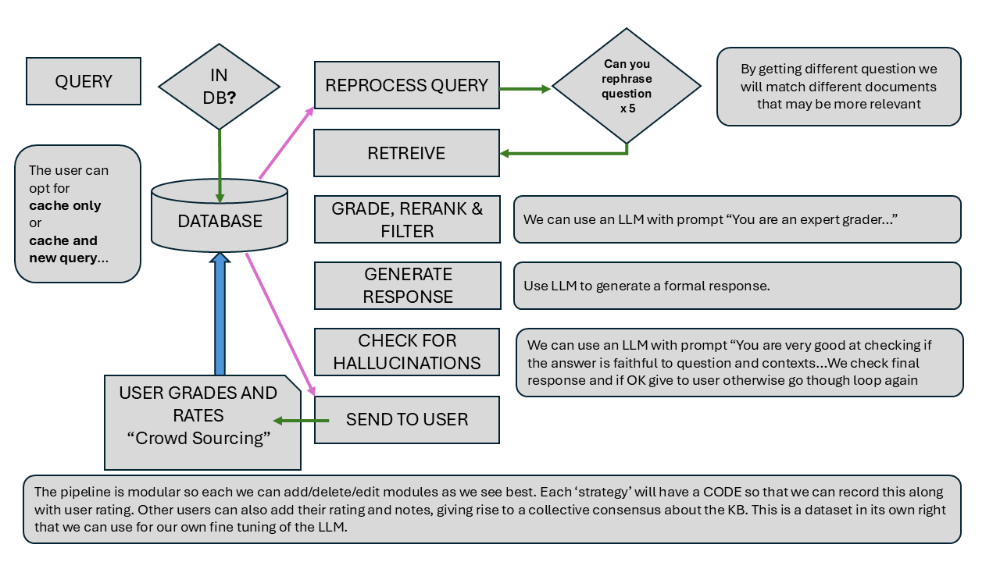

# Current concepts

Let's take a look at some of the current buzz words in this space so that we understand what we are doing.

### LLM

A large language model (LLM) is a type of artificial intelligence (AI) program that can recognize and generate text, among other tasks. LLMs are trained on huge sets of data — hence the name "large." LLMs are built on machine learning: specifically, a type of neural network called a transformer model.

We represent it in our architecture as a brain and this serves us well as we can also think what would a human do at this stage?



### Semantic search

Semantic search vectors are numerical representations of data and related contexts that are used to rank and deliver search results based on their relevance. 

The closer two points in vector space are, the more similar they are.



OpenAI has 1536 dimensions...

There are a few different methods such as cosine similarity, dot product, Euclidean distance etc.

### RAG


RAG = Retrieval Augmented Generation

*RETRIEVAL*:

We retrieve the most useful information from a vector database and then use it to generate a response using the LLM.

*AUGEMENTED*:

We combine the retreived documents and the query and pass it to the LLM to generate a response.

*GENERATION*:

The LLM generates the final response with the augmented context.

### Prompt Engineering

Now the preferred term is *flow engineering*.

There is a difference between sending the documents and query to the LLM on their own compared to using a prompt template:

====================================

"You are an expert in the field of medicine. Answer the following question: {question} based on the following documents: {documents}"

If you are unsure about your answer, say "I don't know".

Use a professional and formal language in your responses.

Where possible, use references from the documents.

====================================

I like to thing of it as giving an actor details about a scene or giving a detailed job description to an researcher.

It is why many of the tech leaders say the new programming language is English/Natural Language. Our work is to create detailed and informative specs for the LLMs.

### AI Agents

What is an Agent? 

Anthropic says:


LLMs are well established in the field of AI Agents. We create a profile of an agent with instructions and then it can carry out that task, calling upon tools we may have given it.

An example:


====================================

You are an expert medical reviewer. Grade the following content for accuracy and completeness. If you are unable to do this then say "I don't know".

If the article is acceptible, return "Acceptable", otherwise return "Not Acceptable".

You have the following tools available:

- Check Accuracy Tool
- Check Completeness Tool
- Check Relevancy Tool

Here is the content to be graded:

[article]

====================================

Whilst we may have our overall flowchart, the AI Agent will determine the path to take based on the output the LLM generates.

Langflow is a framework for building AI Agents and workflows. 

We can see from the snippet of code how LangGraph simplifies the process.    


In essence, we can convert our flowchart into code using Langflow.

## Naive Rag

Two years ago when we first looked at RAG, the strategy was to take a document and split into chuncks of say 500 characters and have an overlap of 100 charactes with the next chunk to maintain some context.

This works very well for single modality text documents where this Niave Rag is in effect a search tool, taking an unstructured query and using LLMs and semantic search to find relevant chunks and answer the question.

## Changes in last 2yrs

In the past two years there have been many changes in the space.

- Context windows, the amount of text we can pass to the LLM has grown from 4K to 32K+
- Compute power has greatly increased, costs have gone donw by 90%.
- LLMs have become bigger and better, with many specialist LLMs that are fine tuned for particular uses.
- LLMs can now understand images, tables and videos better, with LLMs that can parse different media and convert them into text.
- Many frameworks and services for RAG have emerged and 2025 is thought of the year that the question will be which system to use?
- Naive Rag has been replaced with more sophisticated strategies that involve all aspects of the architecture:

Without needing to understand this next image, here is the current 'state of the art' RAG architecture:



New academic papers for better techniques are continually being published.

*"This is the worst it will ever be..."* - someone said.

## Proposed application

First and most importantly we will look at how we ingest articles into our DB.

### unstructured.io 

[unstructured.io](https://unstructured.io/) is a leader in parsing all types of files into strucutred data.

If we think of our pdf as a molecule, then we can break it down into atoms containg the text, images and tables as well as metadata.

This can then be entered into our DB with the apporpriate part vectorised for semantic search.

```
[
    {
        "type": "Title",
        "element_id": "0405351ac64213c7b1e40e31aff7d21b",
        "metadata": {
            "filename": "Bank Good Credit Loan.pptx",
            "file_directory": "tmpdocs",
            "last_modified": "2023-11-02T15:16:14",
            "filetype": "application/vnd.openxmlformats-officedocument.presentationml.presentation",
            "category_depth": 1,
            "languages": [
                "eng"
            ],
            "page_number": 1
        },
        "text": "Bank Good Credit "
    },
    {
        "type": "NarrativeText",
        "element_id": "214987ebee9fd615365185fb3d692253",
        "metadata": {
            "filename": "Bank Good Credit Loan.pptx",
            "file_directory": "tmpdocs",
            "last_modified": "2023-11-02T15:16:14",
            "filetype": "application/vnd.openxmlformats-officedocument.presentationml.presentation",
            "parent_id": "0405351ac64213c7b1e40e31aff7d21b",
            "category_depth": 0,
            "languages": [
                "eng"
            ],
            "page_number": 1
        },
        "text": "Accredited with IABAC™"
    },
    {
        "type": "ListItem",
        "element_id": "5eb6ec96e6a3493c1ae56747ae457b7f",
        "metadata": {
            "filename": "Bank Good Credit Loan.pptx",
            "file_directory": "tmpdocs",
            "last_modified": "2023-11-02T15:16:14",
            "filetype": "application/vnd.openxmlformats-officedocument.presentationml.presentation",
            "parent_id": "2dc308bd8d3a5c745dfacc3bdccd81db",
            "category_depth": 1,
            "languages": [
                "eng"
            ],
            "page_number": 2
        },
        "text": "Data provided"
    },
    {
        "type": "Table",
        "element_id": "0f932c1c78cd59aef141af819dfdcf84",
        "metadata": {
            "filename": "currency.csv",
            "file_directory": "tmpdocs",
            "last_modified": "2023-11-02T15:17:41",
            "filetype": "text/csv",
            "languages": [
                "eng"
            ],
            "text_as_html": "<table border=\"1\" class=\"dataframe\">\n  <tbody>\n    <tr>\n      <td>Code</td>\n      <td>Symbol</td>\n      <td>Name</td>\n    </tr>\n    td>\n      <td>Ft</td>\n           <td>ZK</td>\n      <td>Zambian kwacha</td>\n    </tr>\n  </tbody>\n</table>"
        },
        "text": "\n\n\nCode\nSymbol\nName\n\n\nAED\n\u062f.\u0625\nUnited Arab Emirates d\n\n\nAFN\n\u060b\nAfghan afghani\n\n\nALL\nL\nAlbanian lek\n\n\nAMD\nAMD\nArmenian dram\n\n\nANG\n\u0192\nNetherlands Antillean gu\n\n\nAOA\nKz\nAngolan kwanza\n\n\nARS\n$\nArgentine i rial\n\n\nZAR\nR\nSouth African rand\n\n\nZMW\nZK\nZambian kwacha\n\n\n"
    },
    {
        "type": "Image",
        "element_id": "37883f438c468b3027dd7918a958dacd",
        "text": "15 - & \u2014 10g =} \u2014 & \u20146g N Potential (V) \u2014 2 & = Control 2 e 88 25 T T 0.0000001 0.00001 0.001 01 Current Density (A/cm2)",
        "metadata": {
            "image": "base64 value",
            "filetype": "application/pdf",
            "languages": [
                "eng"
            ],
            "page_number": 1,
            "filename": "embedded-images-tables.pdf",
            "data_source": {
                "url": null,
                "version": null,
                "record_locator": {
                    "path": "C:\\Users\\mrcra\\Desktop\\RAG\\pdf_input\\embedded-images-tables.pdf"
                },
                "date_created": "1727326976.0",
                "date_modified": "1727326976.0",
                "date_processed": "1729367235.6743865",
                "permissions_data": [
                    {
                        "mode": 33206
                    }
                ],
                "filesize_bytes": 109798
            }
        }
    
]
```


The cost for single-modality is $10 for 10,000 pages and for multi-modal it is £10 for 1,000 pages.

*A no-brainer...*


Vision Language model using whole PDF and convert query into VLM vector is very effective.

Unstructured.io has a bunch of LLMs that can process any type of data and probbably does this under the hood.

- Probablistic Search -User Feedback Part
- Vector Search Model - LLM 
- Bindary serach - Traditional Postgres

### Text processing

In the case of text, we can embed the content for semantic search.

It also means we can create articles by gathering relative text fragments and , of course, we can add tables and images.

### Table processing

We get both text_html and text_plain as output.

### Image processing

In the case of an image, we get the Base64 value of the image. 

We don't need to reference a stored image but have it in the outputted element.

This can then be processed with an LLM to get a text description of the image, in addition to the labels attached to the image.

### Audio

Not part of unstructured.io but speech to text APIs are available and well established. We can process the text in the usual way.

### Video

Not part of unstructured.io but YouTube has an API to get transcripts of videos which can then be processed as we would process any text.

Videos are a series of images so there are ways to create descriptions of videos etc.

## Workflow

### FLOWCHART



Using Langflow, we can create a workflow to process the documents. In essence, we first create our own flowchart for human processing and then convert this to code.

Langflow has NODES (entities) and EDGES (connections between nodes). They can be 1:1 or conditional (if/else).


### GET ANSWER FROM CACHE
When a user asks a question, we will first look in the DB if there is already an answer to a similar question. This is built up from the USER RATE FILTER strategy and initially will be empty.


### DO SEMANTIC SEARCH

If there is no answer, we will then run the Langflow workflow to generate an answer.

We can do REFINE_QUESTION as a technique to get better answers. This will involve a number of different strategies outline in the <SECTIONHERE>.

Having a refined question or set of questions, we will then retrieve the best K results.

### RANK & FILTER DOCS

We can then apply strategies to rank the documents and filter out irrelevant ones.

### GENERATE RESPONSE

We send the context content and (refined) question(s) to the LLM to get the answer.

### CHECK NO HALLUCINATIONS

We will then do CHECK_NO_HALLUCINATIONS to check that the final answer is not hallucinated and then send the generated response to the user.
We can use reflective RAG to see if we need to repeat the process.

### USER RATE AND CACHE

The user will then do USER_RATE where the user can give thumbs up/down or rate for accuracy, content, relevancy and clarity as well as adding their own comments and additions to the response.

We will then cache (store) this in the DB for future use.

Obviously, we can use a number of different strategies to generate the final answer.


### GRAPH RAG

One emerging technology is GRAPHRAG. Here, the standard database we use for keyword and semantic search is converted to a Graph Database so that NODES (entities) and EDGES (connections between nodes) can be formed not just within each article but between articles.

*What if we could run a query that gathers all connected and relevant atoms to create a super-article?* (Instead of creating this 'manually' through imperative code).


<br>