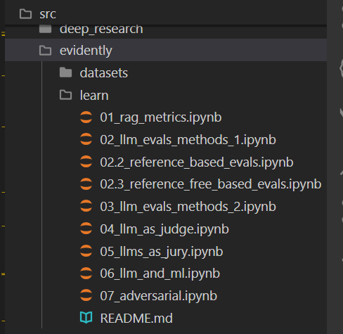

# Evidently.ai

I have found Evidently to be very user friendly with great videos and example code.

It works on dataset rather than being placed in source code.

There are a range of notebooks that work iwth an OpenAI key and they are in the `src/evidently` folder:

One can see from the file names the range of evals it does.

The notebooks are documented and runnable. They are part of the video series [Evidently](https://www.youtube.com/watch?v=jQgI8tTkWQU&list=PL9omX6impEuNTr0KGLChHwhvN-q3ZF12d&index=2).

