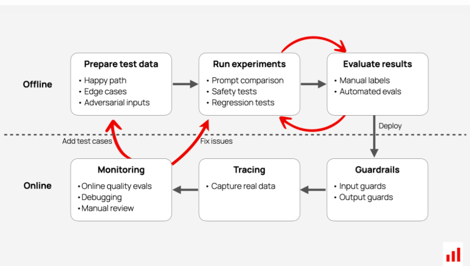
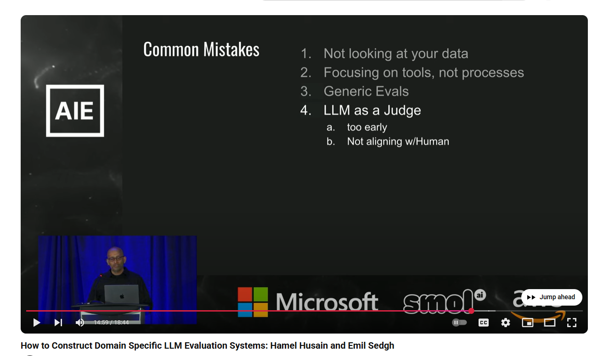

# Overview

> "How do you make a blueberry muffin? You put the blueberries in at start not stuff them in at end." - Accessibility speaker.

It is part of the development lifecycle supporting the developer and all othe rstake holders.

## Evaluations

1. Code based - traditional testing

2. LLM as Judge - specialist LLMs to rate tone, completeness, no PII, matrix analysis, gender bias etc as well as the confusion matrix of input-output-context-reference.

3. ML analysis - we may use ML models to compute a metric.

4. Human Annotations.

Start with Human Evals and scale with LLM Judge. This seems the top recommendation from those in the field.

Human evals will reveal what we need to test.

LLM Judge will enable scaling - we ask the LLM for its reasoning for its grade. 

The experts say this will reveal many things, notably whether the LLM and us are not on the same page in the evaluation process. We can then change the prompt.

## Scoping

- Trace - the run
- Span - items within the run

<!--  -->

## Telemetry

CORE DATA:

- Some of these are optional
- We may use a code to identify the unit under test, e.g `app_unit_test_type`

- ENVIRONMENT (dev/staging/prod)
- DATETIME
- TRACE
- SPAN
- MODEL
- MODEL_KWARGS (temperature etc)
- INPUT
- OUTPUT
- CONTEXT
- TOOL_CALL
- TOOL_INPUT
- TOOL_OUTPUT

(custom data)
- WHAT_DEV_ADDS

These CSVs are appropriately named and will then have REFERENCE ground truth added to provide an dataset for analysis.

There are a number of libraries I like:

1. Evidently AI - favourite of mine as it made Evals easy and enjoyable.
2. Deep Eval
3. RAGAS

## Common mistakes

