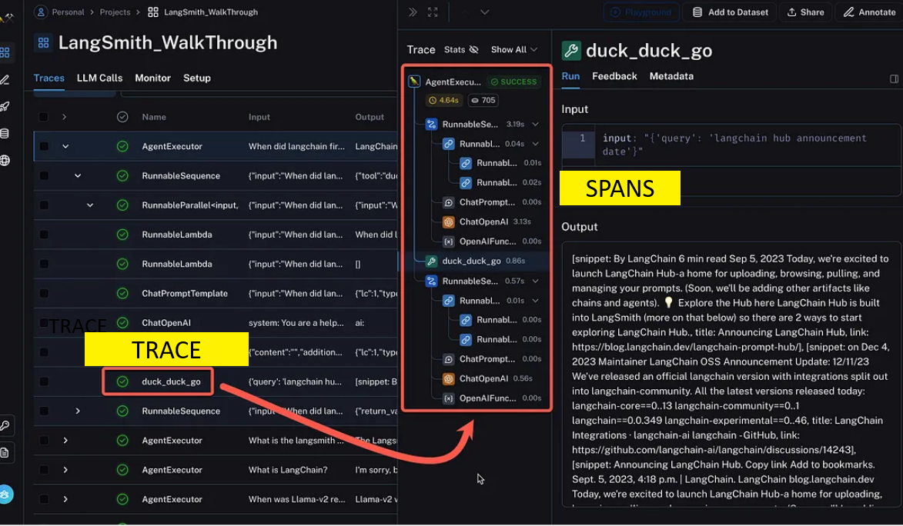

# Overview

## Evaluations

1. Code based - traditional testing

2. LLM as Judge - specialist LLMs to rate tone, completeness, no PII, matrix analysis, gender bias etc as well as the confusion matrix of input-output-context-reference.

3. ML analysis - we may use ML models to compute a metric.

4. Human Annotations.

## Scoping

- Trace - the run
- Span - items within the run

<!--  -->

## Telemetry

CORE DATA:

(some optional)

- ENVIRONMENT (dev/staging/prod)
- DATETIME
- TRACE
- SPAN
- MODEL
- MODEL_KWARGS (temperature etc)
- INPUT
- OUTPUT
- CONTEXT
- TOOL_CALL
- TOOL_INPUT
- TOOL_OUTPUT

(custom data)
- WHAT_DEV_ADDS

These are CSVs appropriately named, that will have REFERENCE ground truth added to provide an dataset for analysis.

There are a number of libraries I like:

1. Evidently AI
2. Deep Eval
3. RAGAS

