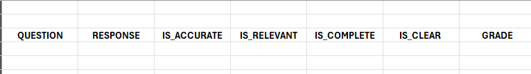

# Evaluation Overview

There are a number of ways we can evaluate the performance of the app. 

These use traditonal Natural Language Processing (NLP) and Machine Learning (ML) techniques.

The main library we use, and this is more for the developers as we are developing different strategies, is [RAGAS](https://docs.ragas.io/en/stable/).

## Ragas metrics

### Context Precision 

This is a metric that measures the proportion of relevant chunks in the retrieved_contexts. It is calculated as the mean of the precision@k for each chunk in the context. Precision@k is the ratio of the number of relevant chunks at rank k to the total number of chunks at rank k.

### Context Recall

Context Recall measures how many of the relevant documents (or pieces of information) were successfully retrieved. It focuses on not missing important results. Higher recall means fewer relevant documents were left out. In short, recall is about not missing anything important. Since it is about not missing anything, calculating context recall always requires a reference to compare against.

### Faithfulness

Faithfulness metric measures the factual consistency of the generated answer against the given context. It is calculated from answer and retrieved context. The answer is scaled to (0,1) range. Higher the better.

The generated answer is regarded as faithful if all the claims made in the answer can be inferred from the given context. To calculate this, a set of claims from the generated answer is first identified. Then each of these claims is cross-checked with the given context to determine if it can be inferred from the context. 

## Other evaluations

There are many libraries for evaluating the perfromance of our app, like Giskard and Huggingface.

## Domain Expert Evaluation

Ultimately, the real test is that of the domain expert.

Here, we have a set of questions and answers and we want to evaluate the performance of the app.

We can create a set of 'ground truths', questions and their correct answer set up by domain experts.

We can then have our app generate answers and context to these questions for a domain expert to assess, not just the accuracy but also whether the context returned was relevant:

