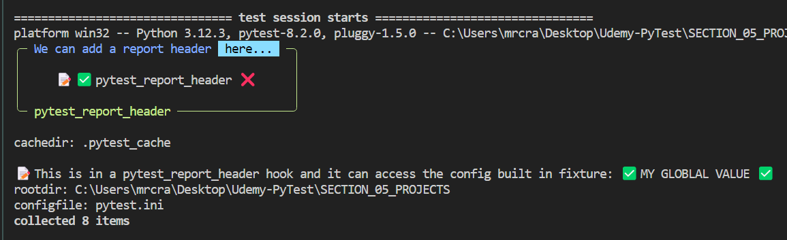
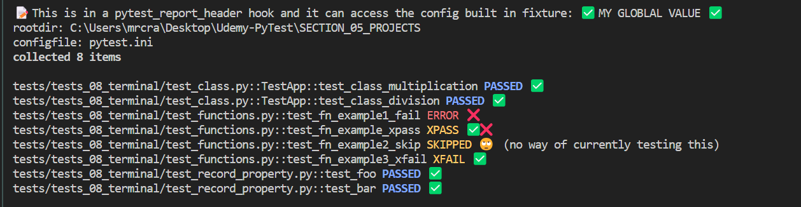

# PyTest Full Stack

When I was studying/working with PyTest, I came across a great many resources, yet each was not complete.

I put together a template for PyTest Full Stack that enabled developers to drop thier app in `src` and have a complete PyTest Full Stack suite to test from DB schema all the way through API and E2E testing.

It contains around 200 template tests from DB Schema to API and E2E browser tests that are ready to go.

I published the manual at [https://pytest-cookbook.com/](https://pytest-cookbook.com) and the repo at [https://github.com/Python-Test-Engineer/PyTest-Full-Stack](https://github.com/Python-Test-Engineer/PyTest-Full-Stack).

It had HTML, Coverage and its own CSV custom reporting built in as well as some plugins for console formatting.

I gave a workshop 'Getting started with PyTest' at PyCon Ireland in November 2024.

This can then be used as a full QA testing of an application.

## Evaluating AI Agents

We can do Agentic Evals as already discussed.

## API

If we have a NextJS app we can do API testing as well.

## E2E

If we have a NextJS app we can do E2E testing with Playwright, capturing screenshots and videos. 

We can also record tracing for debugging.