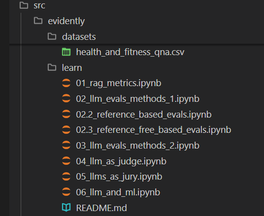
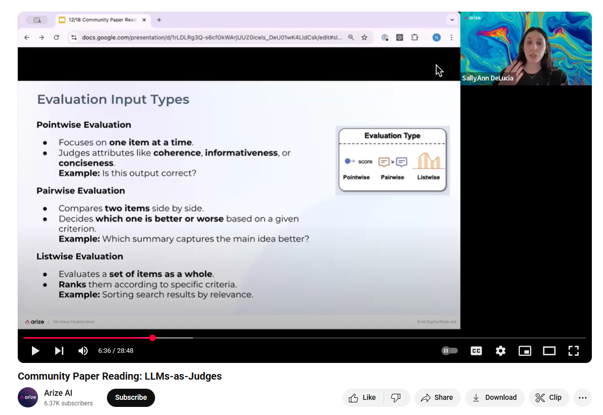
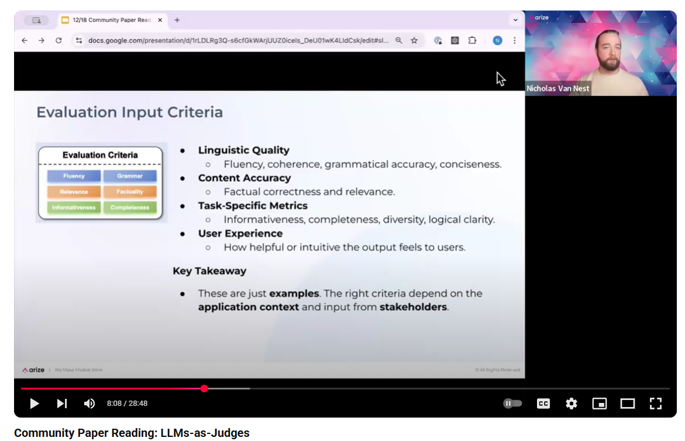
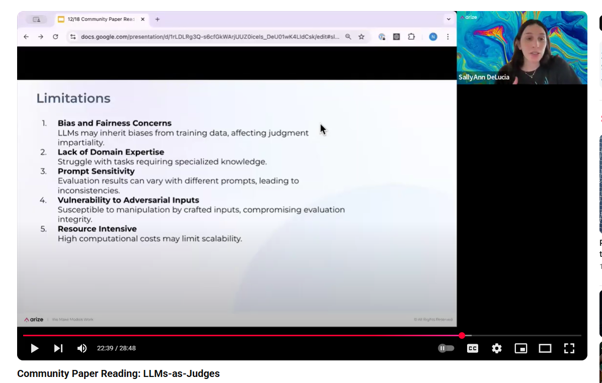

# LLM as judge

The technique of an (untested) LLm generating question/answer pairs to act as ground truths to then test an LLM seems illogical but current thinking states this is quite effective.

This technique might be used by developers to improve the knowledge system as they work on it rather than getting human evaluations at every step.

This is more of a development tool rather than final evalauation.

Arxiv Paper: [https://arxiv.org/pdf/2412.05579](https://arxiv.org/pdf/2412.05579)

[Useful article](https://medium.com/towards-generative-ai/judgeit-automating-rag-evaluation-using-llm-as-a-judge-d7c10b3f2eeb)

## Uses

Some example additional uses:

- Politeness: Is the response respectful and considerate?
- Bias: Does the response show prejudice towards a particular group?
- Tone: Is the tone formal, friendly, or conversational?
- Sentiment: is the emotion expressed in the text positive, negative or neutral?
- Hallucinations: Does this response stick to the provided context?
- Adversarial: We can test it does NOT do things as well as test edge cases.

By asking for not just the grade but its reasoning, we can get a more complete picture of how the judge is evaluating the LLM.

Code demo:

> Examples

[https://www.youtube.com/watch?v=LZJTrAXcyFM](https://www.youtube.com/watch?v=LZJTrAXcyFM)

