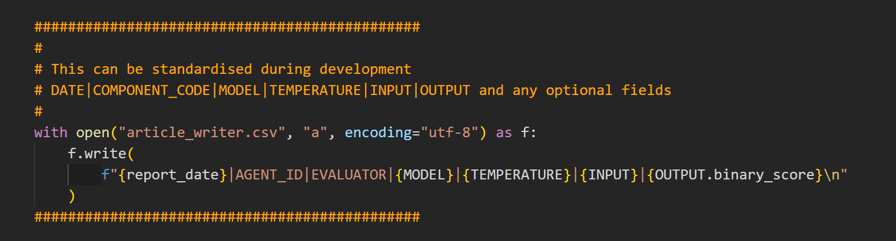
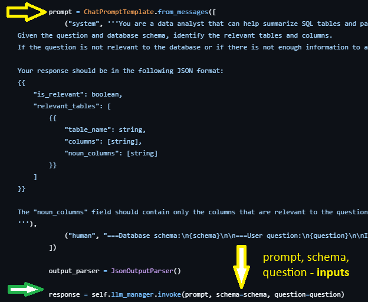

# TLDR

Test: 
- In production 
- In real time 
- In front of the client

> Two decoupled parts - observability and evaluation

## Observability

1. Observability by tracing/logging out data.
2. Performing evals on these datasets.

Agents/tools are (mathematically) a function with:

- input
- output
- context (optionally)
- metadata (model, temperature, etc.)

Each Agent has its own **self-reflection** by exporting the above to a CSV.

This CSV can then be analysed using a range of Eval Libraries like Evidently, DeepEval and Ragas, with or without references (ground truths).

We can have two traces at each point. One a more concise version for the developer (and QA) as well as a complete trace for the QA.

We find where the LLM point is in our code if we are doing evals after dev:

## Evaluation

> Add REFERENCE column to dataset and then do evals.

Once we have our output dataset, we can add ground truths/references and then carry out evals using a range of libraries like Evidently.ai, (my favourite), RAGAS, DeepEval etc.

We can also create our own evals.

The log files are generated in real time enabling not just evaluation but also real time monitoring.

I have also found the log files very useful during development work and bug-fixing.

## Advantages

> Decouples app code and evaluation code.

> Portable Agent/Eval combinations.

> Evals are real time and support both developer and QA.

> Frictionless integration to existing apps and new ones.

> CSV output easier to digest than UI traces. In fact, I tend to want to export the traces as CSVs.

> If we are using some sort of Agent Context Protocol, we can avoid mixed telemetry systems by having each agent do its own telemetry.

 
