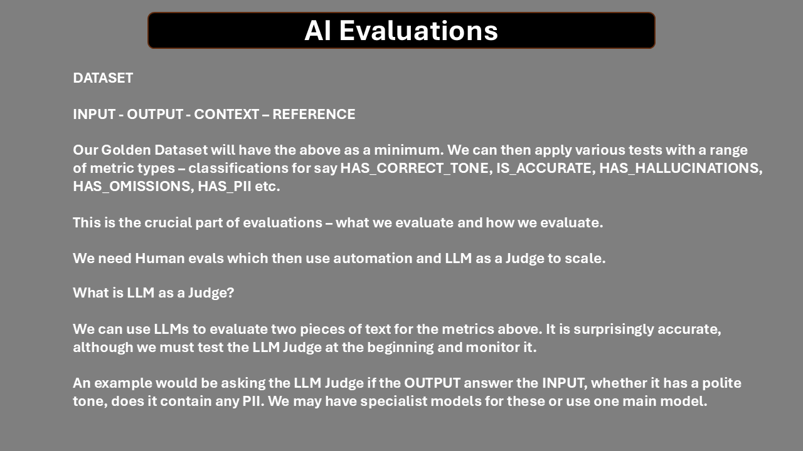

# Evaluating AI Agents

## Aim

This is a manual to establish EvalOps - a way of testing and evaluating Agentic systems.

### Agentic Evaluations

We can see an Agentic workflow:

A Unit Test in agentic terms is the smallest block of code that uses an llm to determine the ROUTE and the RESPONSE.

<!--  -->

### The App

I have built an app that allows you to evaluate agentic systems. 

The repo is ... and we will use it to first understand the nature of the app and then determine how we test and evaluate it before using the tools to do this.