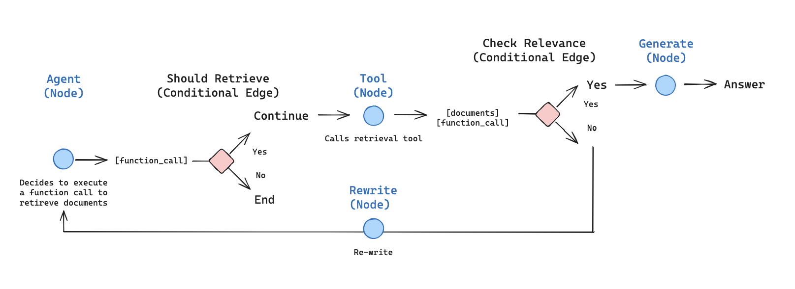

# AI Powered Knowledge Systems

This is a work in progress where I collect resources and ideas concerning AI Search, Agentic AI and AI Data Analyst.

As others have shared with me, I share my own research.

The areas I am working on are:

## AI Search

Using both Semantic and traditonal keyword search, a Hybrid search system can yield the best document retrieval for RAG implementations, particularly when combined with Agentic RAG strategies.

We get the best k results from Full Text Search/Keyword search and the k best results from semantic search, combine them together, rerank and then return N best results.

## Agentic RAG

Retrieval Augmented Generation enables us to add domain specific data to our our prompts for better answers.

Agentig RAG uses Agents to plan, retrieve, refine and generate answers using specilaist agents for each of these aspects.

An example of this is Langgraph's **agentic-RAG**:

## AI Data Analyst

The use of AI Agents in the Data Pipeline from ETL, Analysis to Reporting enables us to generate reports from data sources.

This is the emerge of the AI Data Analyst.

Some aspects are best done with traditional Data Processing and we should not make them agentic just because that is in fashion.

This can add non-deterministic bureaucracy to the data pipeline.

There are two main approaches that are detailed in this book - creating SQL queries on the fly and using LLMs to select the most suitable SQL Query that has been developed and tested using AI Search of stored SQL Query Documents that contain not just the SQL but also metadata for report types and charts: 

[https://ai-powered-knowledge-systems.netlify.app/ai_data/#text2sql](https://ai-powered-knowledge-systems.netlify.app/ai_data/#text2sql)

 