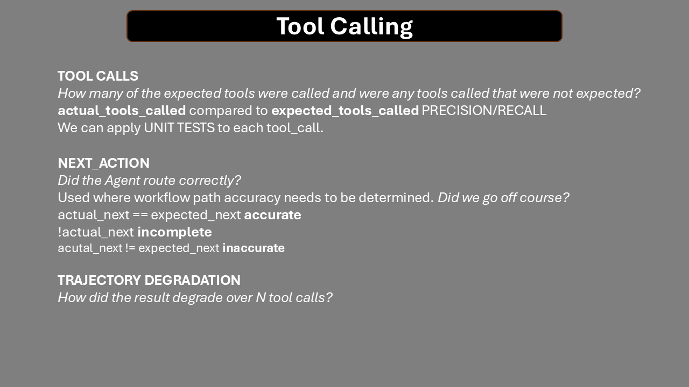

# Evaluating AI Agents

## Aim

This is a manual to establish EvalOps - a way of testing and evaluating Agentic systems.

### Agentic Evaluations

From https://langchain-ai.github.io/langgraph/tutorials/rag/langgraph_adaptive_rag_local/ we can see an Agentic workflow:

A Unit Test in agentic terms is the smallest block of code that uses an llm to determine the ROUTE and the RESPONSE.

<!--  -->

