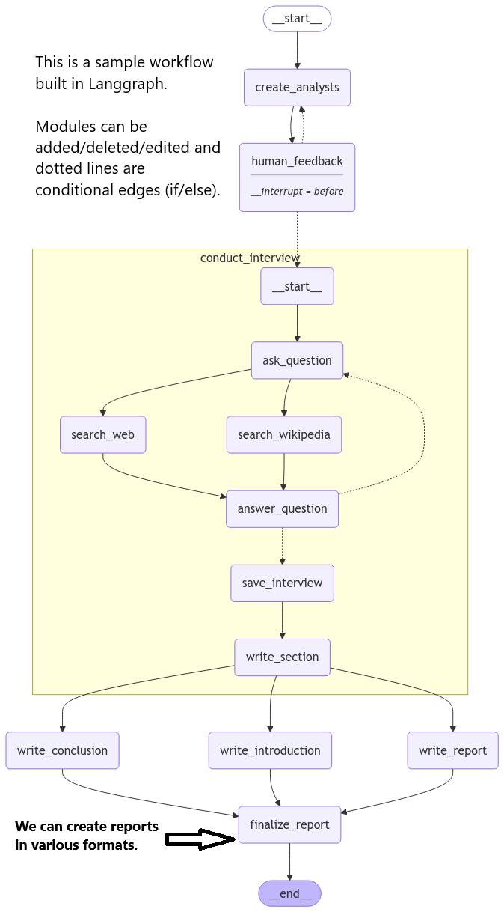

# AI Powered Knowledge Systems 

AI Powered Knowledge Systems is an architecture and app to enable organisations to search through their knowledge base for answers to questions and use AI Agents to create reports and other content.

There are a number of core components in the architecture and these are listed below.

## Database

We use Postgresql as the database and rather than process documents with each query, we use databases to store the documents and then use keyword and semantic search to find the most relevant elements of information. To enhance speed and accuracy, further tradional Natural Language Processing is applied.

I have found [https://unstructured.io/](https://unstructured.io/) to be a leader in parsing all types of files into structured data. The cost for multi-modal files is $10 for 1,000 pages and for single-modal it is $10 for 10,000 pages.

This is a no brainer cost wise as far as I am concerned.

- We extract all the 'atoms' of information from 'molecules' of articles, like paragraphs, tables, images etc.
- Using unstructured.io we can parse any type of file into structured data.
- Any tabular or image atoms can be further processed using LLMs to generate content and metadata.
- The atoms are then stored in a database. Vectorisation can take place in the database when we use PostgresML or done separately.
- We can create Named Entities and use them as tags.
- We then use LLMs and semantic search along with keyword search to answer questions form a user.
- An emerging technology is to use Graph Databases to develop retlationships between atoms and molecules for further retrieval capabilites.

The atoms are stored in a database in the following format with additonal Natural Language Processing techniques applied to speed up future search:

## Retrieval Strategies

There are many and growing number of strategies for doing semantic search.

The image below is for illustrative rather than informative puproses and shows the growing number of strategies that are being implemented. 

These would be modular and different ones can be used based on user queries.

## Crowd Sourced Answers

## AI Agents

The definition of and Agent is quite broad and varied.

Github states: "Agentic AI refers to artificial intelligence capable of making decisions, planning, and adapting to new information in real time. AI agents learn and enhance their performance through feedback, utilizing advanced algorithms and sensory inputs to execute tasks and engage with their environments."

Perhaps a simple version is from Langchain, which defines and agent as using LLM to determin the flow of an app.

Using Langgraph, we can convert business case flowcharts to Agentic workflows.

This is the compiled workflow for an example Langgraph workflow.

All nodes and edges are customisable and we can add/delete nodes and edges as required.

The workflow we will using is the following:

 - Better questions get better answers so we get the LLM to write 5 versions of the user's question and answer them all.
 - We rerank the documents based on the quality of the answers.
 - We filter out documents that are not relevant to the question.
 - We can then check that the answer is not hallucinated.
 - With the content and sources, we can generate a report or answer the user's question.
 - We can also connect to other data sources to enhance the answers and reports.

## Database Queries

In our database we can then reconstuct any article through various strategies of gathering and joining atoms.

We have 4 ways of performing queries

1. Traditional binary search of SQL. This is incredibly powerful for filtering out data not relevant to the query, like search by year, topic, author etc. We can tokenize and perform Named Entity Recognition with MedSpacy to create tags for each atom.

2. Vector search based on semantic similarity using LLMs.

3. Graph based serach using relationships between entities. This is an emerging technology for RAG, (Retreival Augmented Generation which will be explained later). One example would be a query that asks for information for a collection of authors who have worked together  previously but not currently. Or we may detect entities in the text that are not encapsulated in the database but would be useful in queries.

4. Crowd sourced answers - when a user runs a query and gets a result, we can ask the user to rate it and add their own comments. There are a number of features to this which will be discussed later. This will also provide a dataset for further ML options.

With this atomic version of data, we can carry out summarisation, queries etc. and also build reports that aggregate information from many sources.

## Costs and Income

### Data Ingestion

We have seen previously that unstructured.io costs $10 for 1,000 muliti-modal pages and $10 for 10,000 single-modal pages. If we further process tabular data and images there are LLM costs for this.

Using a wighted average of the costs for 1,000 and 10,000 pages we get a cost of $5 for 1,000 pages and $50 for 10,000 pages.

### Servers

Hosting a database and API has a base cost of $30-100 per month dependin gon type of infrastructure used. This can then scale up as required, which will incur additionsal costs but these would be covered by users.

LLM costs can be covered by the user entering their own API key to use OpenAI for example or the cost could be calculated based on useage and billed accordingly.

Income can be generated on a Pay As you Go basis or a subscription model. A hybrid is also possible.

### Monitoring

If this is a Sofware as a Service, (SASS), product then it is important to monitor the performance of the system and handle user queries.

Like any business, this would be based on financial principles.

### Development

Coding is 10% of the project.

Data collection and preparation, combined with monitoring the systems is the other 90%.

Evaluating performance of the system is also important.

What is important to remember is that this system is not just a Knowledge Base but also an AI Research Assistant.

