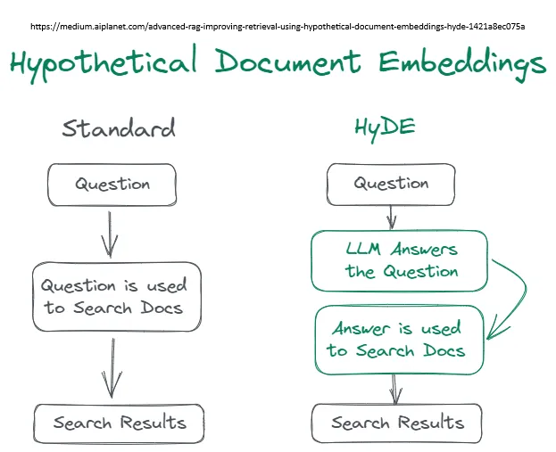

# Improve question

We can process the query using a pre-query to increase the quality of retrieval.

As in human life, better questions lead to better answers.

## Multi Query

We get the LLM to make N versions of the user query and then get all the unique documents for them.

If we have done some of the preprocessing mentioned previously in the "Ingest and NLP" phase, we can then have a better hit rate as we will have many variations of the user query compared to the many documents in the knowledge base that have had preprocessing applied to them.

## HyDE

Hypothetical document embeddings is a technique that creates a theoretical document when responding to a query, as opposed to using the query and its computed vector to directly seek in the vector database.
