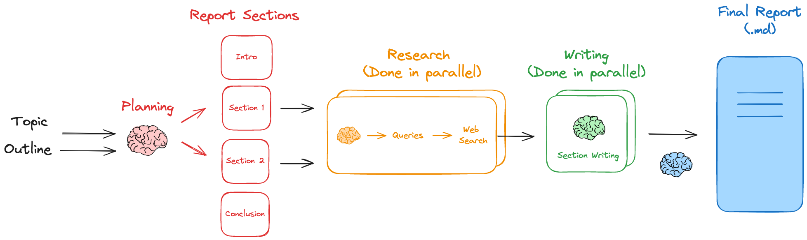

# Generation

Finally, once all thge checks have been passed the LLM can pass the response to the user ready for user evaluation and feedback.

We can use agents that create specific reports based on the instructions we give it to generate reports for a user.

An example of this is Langgraph's **report-mAIstro** that uses parallel and serial processes to generate sections for a report based on the user's question:



All we need modify is the prompt template:

```
This report type focuses on comparative analysis.

The report structure should include:
1. Introduction (no research needed)
   - Brief overview of the topic area
   - Context for the comparison

2. Main Body Sections:
   - One dedicated section for EACH offering being compared in the user-provided list
   - Each section should examine:
     - Core Features (bulleted list)
     - Architecture & Implementation (2-3 sentences)
     - One example use case (2-3 sentences)
   
3. No Main Body Sections other than the ones dedicated to each offering in the user-provided list

4. Conclusion with Comparison Table (no research needed)
   - Structured comparison table that:
     * Compares all offerings from the user-provided list across key dimensions
     * Highlights relative strengths and weaknesses
   - Final recommendations
```

meaning that a non-tech business analyst, for example, can develop a report on any topic area in any style by supplying a text file to the developers or submit via a form for example.